# Практическоие задания по теме "`Docker`" - `Белый Михаил`

## Блок 1: Основы жизненного цикла и изоляции

### Задание 1. PID 1 и сигналы

1. Запусти контейнер с образом alpine в фоновом режиме с командой sleep 3600. Назови его test-sleep.

```
docker run -d --name test-sleep alpine sleep 3600
```
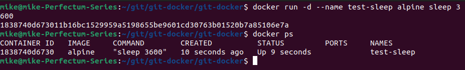

2. Выполни команду `docker exec test-sleep ps aux`. Объясни, почему процесс sleep имеет PID 1 внутри контейнера.

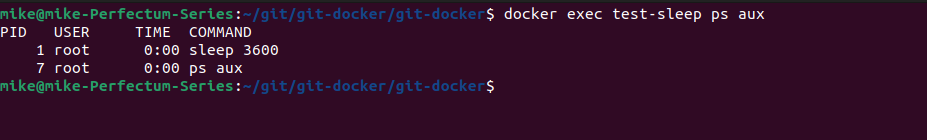

```Одним из базовых механизмов контейнеризации является изоляция процессов с помощью Namespaces. Существуют разные типы изоляции: сети, пользователей и т.д. В данном случае демонстрируется PID Namespase - изоляция процессов. Процесс sleep изолирован от процессов хоста (он не взаимодействует с другими процессами, запущенными на хосте) и является первым в контейнере ```

3. Останови контейнер командой `docker stop test-sleep`. Замерь время выполнения. Затем удали контейнер.

`Остановка контейнера заняла около 10 секунд`
```
docker rm test-sleep
```

4. Запусти тот же контейнер заново, но останови его командой `docker kill test-sleep`. Замерь время выполнения.

`Остановка была выполнена мгновенно`

5. Вопрос: Опиши разницу в поведении stop и kill с точки зрения сигналов Linux (SIGTERM vs SIGKILL)

`Команда stop вызывает сигнал SIGTERM - корректное завершение процесса`
`Команда kill вызывает сигнал SIGKILL - убивает процесс, неожидая завершения. Не рекомендуется использовать.`

### Задание 2. Namespace на практике (unshare)

1. Не используя Docker, выполни на хостовой Linux-машине: `sudo unshare --fork --pid --mount-proc bash`.

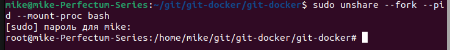

2. Оказавшись в новом шелле, выполни `ps aux`. Что ты видишь? Почему список процессов такой короткий по сравнению с обычным выводом `ps aux` на хосте?

`Ситуация аналогична ситуации из первого задания при работе с docker-контейнером.`
`Работает тот же механизм - Namespace PID, изолирующий процесс bash от остальных процессов хоста и присваивающий ему PID=1.`
`Другие процессы не видны в рамках изоляции`

3. Выполни `exit`, чтобы вернуться.

4. **Вопрос**: Какую технологию Docker использует для создания именно этого эффекта (ограничение видимости процессов) и как называется конкретный namespace?

`Технология изоляции процессов - Namespace PID.`

---

## Блок 2: Слои, образы и дисковое пространство (Администрирование)

### Задание 3: Анализ слоев образа

1. Напиши простой Dockerfile на основе alpine, который:

  - Создаст файл /layer1.txt с текстом "Layer 1".

  - Создаст файл /layer2.txt с текстом "Layer 2".

  **Важно**: Используй две отдельные инструкции RUN для создания файлов.

  [Dockerfile](./Dockerfile)

2. Собери образ с тегом `layer-test:v1`.

```
docker buildx build -t layer-test:v1 .
```
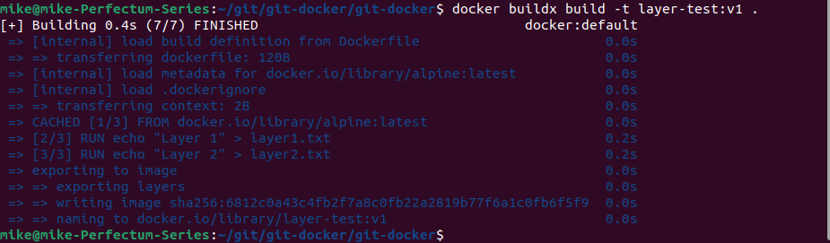

3. Выполни команду `docker history layer-test:v1`.

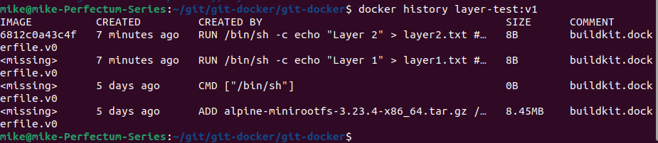

4. `Вопрос`: Глядя на вывод `docker history`, определи, какие слои принадлежат базовому образу `alpine`, а какие созданы твоими инструкциями `RUN`. Почему размер слоя, созданного `RUN echo...`, может быть равен 0B?

`Первый (нижний в списке) слой принадлежит базовому образу alpine. 2 верхних слоя были созданы инструкциями RUN.`

`Слой созданный инструкцией RUN echo может равнятся 0B потому, что в команду echo не передается никаких данных`

### Задание 4: Редактирование слоя и docker diff

1. Запусти контейнер на основе образа `nginx:alpine` (облегченная версия, как в best practices) с именем `web-diff`.

```
docker run -d --name web-diff nginx:alpine
```
2. Выполни команду `docker exec web-diff sh -c "echo 'Admin was here' > /usr/share/nginx/html/admin.html"`.

3. Выполни команду `docker diff web-diff`

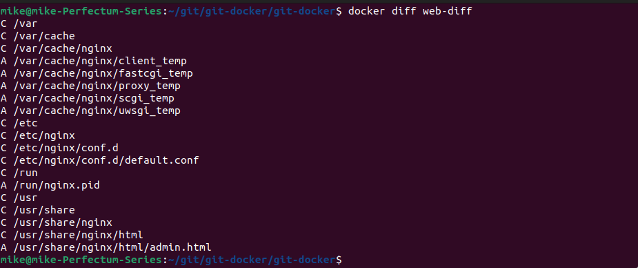

4. **Вопрос**: В выводе `docker diff` ты увидишь флаги `C` (Change), `A` (Add), `D` (Delete). Что означает буква `C` перед записью `/var/cache/nginx`? Почему Nginx меняет эту директорию, хотя мы ее не трогали напрямую?

`?`

5. Удали контейнер `docker rm -f web-diff`. Что произошло с файлом `admin.html`? Почему в продакшене так делать нельзя?

`Все данные, содержащиеся в контейнере (в т.ч. файл admin.html) при удалении контейнера удаляются вместе с ним. Чтобы сохранить пользовательские данные необходимо использовать монтирование volumes`

### Задание 5: Очистка переиспользуемых данных

1. Выполни `docker system df`. Обрати внимание на строку **Build Cache**.

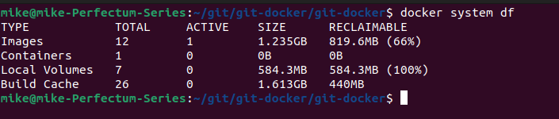

2. Снова собери образ `layer-test:v1` из Задания 3. Замерь время сборки.

```
docker buildx build -t layer-test:v1 .
```
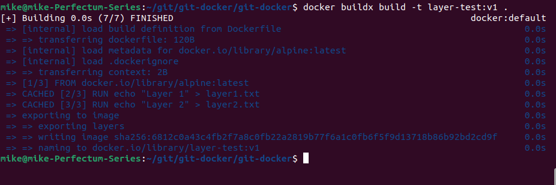

`Время сборки равно 0 секунд. Все слои закэшированы`

3. Снова собери его же. Сборка пройдет мгновенно.

4. Выполни `docker system df` еще раз. Объем Build Cache не должен сильно вырасти.

`Без изменений`

5. Теперь измени первую строку `RUN` в Dockerfile (например, текст на "Layer 1 updated") и собери образ заново.

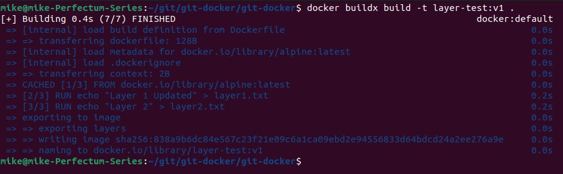

6. **Вопрос**: Сборка начнется не с нуля, но медленнее, чем во второй раз. Объясни, как кэширование слоев зависит от порядка инструкций в Dockerfile. Какие слои переиспользовались, а какие были созданы заново и почему?

`Изменение в любом слое влечет за собой пересборку данного слоя и всех последующих. В связи с этим, необходимо часто изменяемые слои размещать ближе к концу`

---

## Блок 3: Сеть, Volumes и Данные (Инженерные задачи)

### Задание 6: Типы монтирования (Bind vs Volume)

1. Создай на хосте директорию `/tmp/docker_host_data` и файл в ней `host.txt`.

```
mkdir /tmp/docker_host_data
touch /tmp/docker_host_data/host.txt
```
2. Запусти контейнер с **Bind Mount**: `docker run -it --rm -v /tmp/docker_host_data:/container_data alpine sh`.

3. Внутри контейнера создай файл `/container_data/container.txt`.

```
touch /container_data/container.txt
```
4. Выйди из контейнера. Проверь, появился ли файл `container.txt` на хосте. Удали директорию `/tmp/docker_host_data` на хосте. Восстановится ли она после перезапуска контейнера? (Нет, конечно).

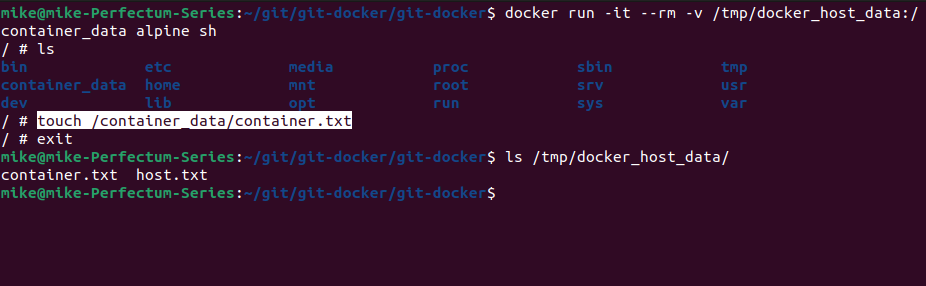

```
rm -r /tmp/docker_host_data
```
5. Теперь создай **Docker Volume** `my-test-vol`.

```
docker volume create my-test-vol
```
6. Запусти контейнер с этим томом: `docker run -it --rm -v my-test-vol:/app alpine sh` и создай файл `/app/volume.txt`.

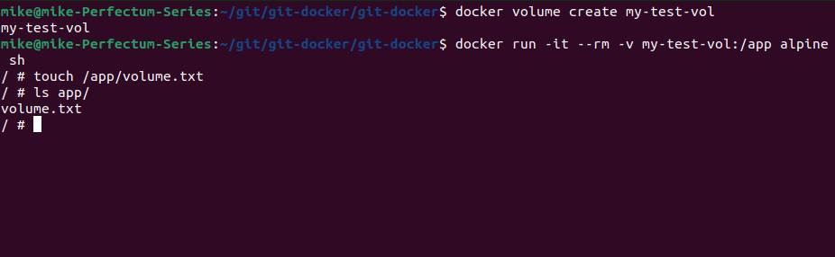

7. Удали контейнер.

`В предыдущей команде был флаг -rm`

8. Где физически на хосте (путь в ФС) лежит файл volume.txt?

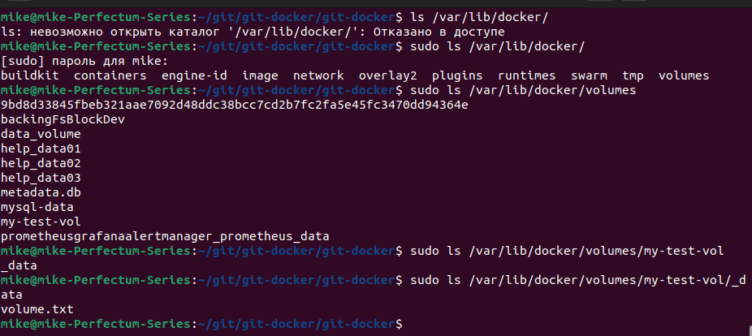

9. ****Вопрос**: В каком случае ты будешь использовать bind mount, а в каком named volume в production-окружении для базы данных?

`Volume Mounting предпочтителен, если нужно расшарить том с другими контейнерами`
`Bind Mounting возможно полезен для размещения тома на съемных носителях`

### Задание 7: Изолированная сеть и DNS

1. Создай сеть `docker network create isolated-net`.
2. Запусти два контейнера alpine в фоне в этой сети с именами alpha и bravo.
```
docker run -d --net isolated-net --name alpha alpine sleep infinity
docker run -d --net isolated-net --name bravo alpine sleep infinity
```
3. Выполни `docker exec alpha ping -c 2 bravo`.

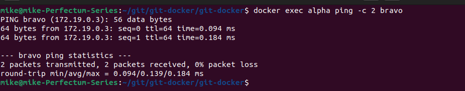

4. Вопрос: Почему команда ping bravo сработала, хотя мы не прописывали никаких --link или записи в /etc/hosts? Какой встроенный механизм Docker это обеспечивает?

```
docker network inspect isolated-net
```
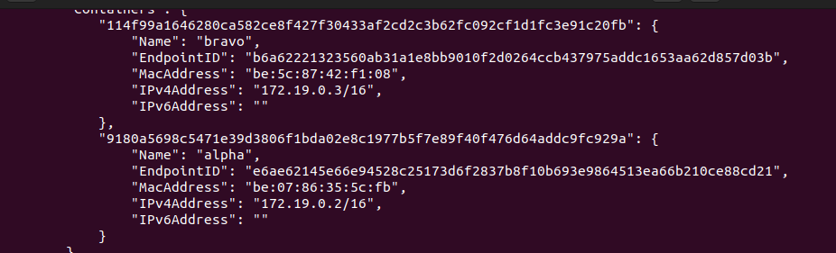

`При запуске оба контейнера были помещены в одну сеть с помощью флага --net isolated-net. Это подтверждает вывод команды docker inspect.`

### Задание 8: Многоступенчатая сборка (Оптимизация размера образа)

1. Напиши программу на Go
2. Собери ее в контейнер **одноступенчатым** способом: базовый образ `golang:latest`.

[Dockerfile](./go.Dockerfile)

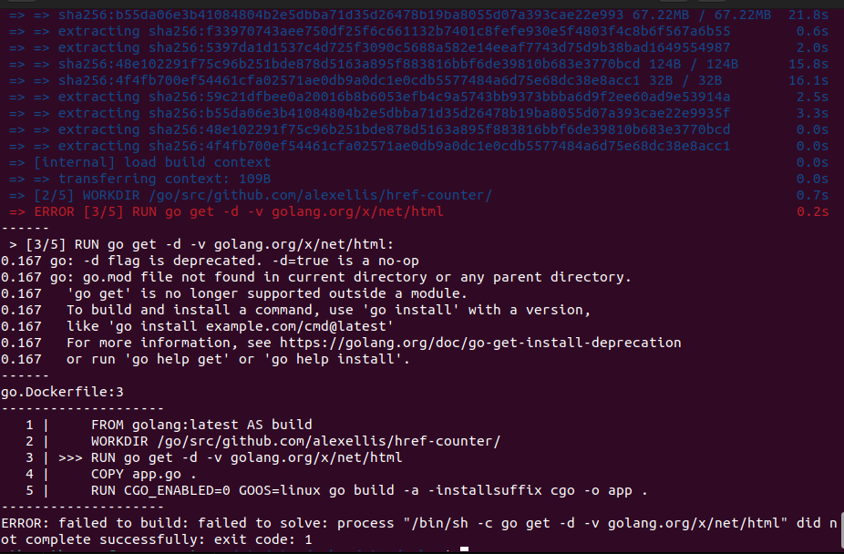

3. Проверь размер образа (`docker images`).
4. Теперь перепиши Dockerfile с использованием Multi-stage build (FROM ... AS builder, и потом FROM alpine:latest).
5. Собери образ заново.
6. **Вопрос**: На сколько мегабайт уменьшился образ и за счет чего? Какие лишние файлы остались в первом случае и не попали во второй?

## Блок 4: Безопасность и Runtime (Senior Level)

### 9. Задание 9: Secrets и History (Безопасность)

1. Напиши Dockerfile, который содержит инструкцию: `ENV MY_SECRET_TOKEN=SuperSecret123`.

[Файл Dockerfile с секретом](./Dockerfile)

2. Собери образ `secret-leak:latest`.

```
docker buildx build -t secret-leak:latest -f Dockerfile .
```
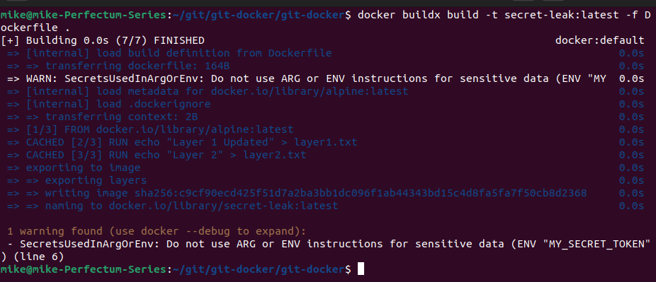

```
docker history secret-leak:latest
```
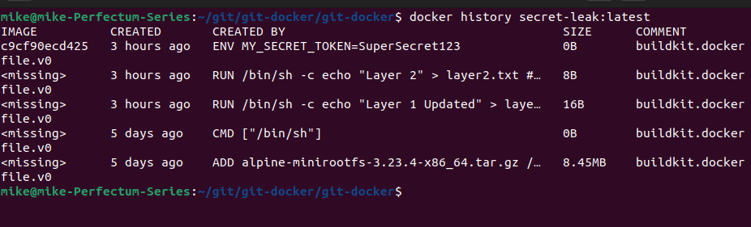

3. Удали образ. Выполни `docker system prune -a`, чтобы очистить кэш сборки (будь осторожен, убедись, что у тебя нет важных остановленных контейнеров).
4. Теперь построй образ безопасным способом, используя `--secret` (BuildKit), например, создав файл `.env` с токеном и примонтировав его только на время выполнения `RUN`, как описано в разделе "Работа с секретами" (пример с `--mount=type=secret`).

[Secret Dockerfile](./secret.Dockerfile)

```
export MYSECRET=qwerty
docker buildx build --secret id=env_sec,env=MYSECRET -t secret-image -f secret.Dockerfile .
```
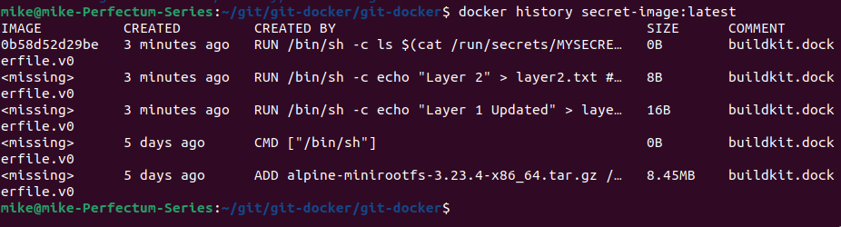

5. **Вопрос**: Можешь не писать код монтирования, но объясни текстом: почему в первом случае пароль можно украсть даже после удаления контейнера и образа (если не чистить слои), и как работает механика --mount=type=secret, предотвращающая попадание секрета в слой образа?

`?`

### Задание 10: Capabilities и привилегии (Hardening)

1. Запусти обычный контейнер `alpine`, попробуй выполнить команду изменения hostname: `docker run --rm alpine hostname new-hostname`. Получишь ошибку `Operation not permitted`. Почему?

`Полагаю, что имя хоста относится к нижнему слою контейнера и его нельзя изменить в обычном режиме`

2. Теперь запусти контейнер с флагом `-privileged` и выполни ту же команду. Она сработает.

3. Теперь сделай то же самое без `--privileged`, но с добавлением конкретной capability: `--cap-add=SYS_ADMIN`.

`Тоже успех`

4. Вопрос: Сработала ли команда с SYS_ADMIN? Если нет, какая capability отвечает именно за смену hostname (подсказка: man capabilities или поиск по CAP_SYS_ADMIN vs CAP_SYS_ADMIN domainname)? Объясни, почему давать контейнеру SYS_ADMIN все еще опасно, даже если это не --privileged.

`?`